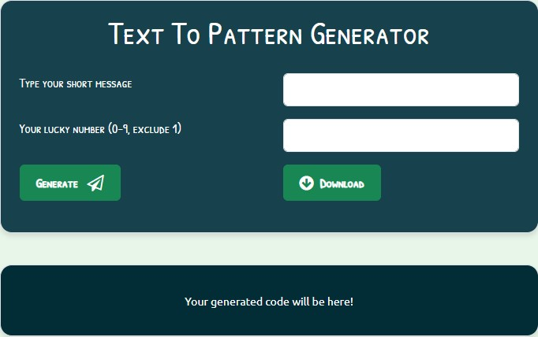
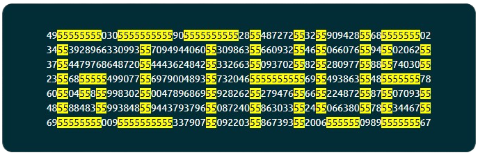

# Text To Pattern Generator

Text To Pattern generator is a fun app that was built for fun few years back. The idea poped-up for this when i was tying to find a word in a web page and browser highlited it in yellow. So yeah, i though to use this find and highlite feature to build this app. 

This app takes a short message as an input and generates a random number with a your short message hidden into it and not easily readable. It allows you to alos download an HTML file that can be sent same as other files. However, it opens up in a web browser where the receiver can read senders hidden message. To read a sender's message a receiver needs a key which is nothing but a 1 digit number that you used while generating message.

Try it out yourself and have a fun!

> [!NOTE]  
> Works on computer, may not work well in mobile or other devices!

## How to use?
- Open html file (*src/text-to-pattern-generator.html*) in browser (prefered chrome).
- Type your short message or word in the first text box and any number between 0 to 9 (except 1) in second text box, then click on generate.
- You will see the bunch of numbers in output area.
- To read the message inside those number, press control + F or command + F, type number that you choose while generating pattern and press enter. :)
- There you go!
- You can also download the plain HTML file in case if you want to share your message with someone.

## Snapshot(s)

---

### Future Action Item(s)
- Design change
- Allow to generate a message in any ASCII characters
- Come-up with own algorithm that translates a charcter to pattern automatically or use the existing one
